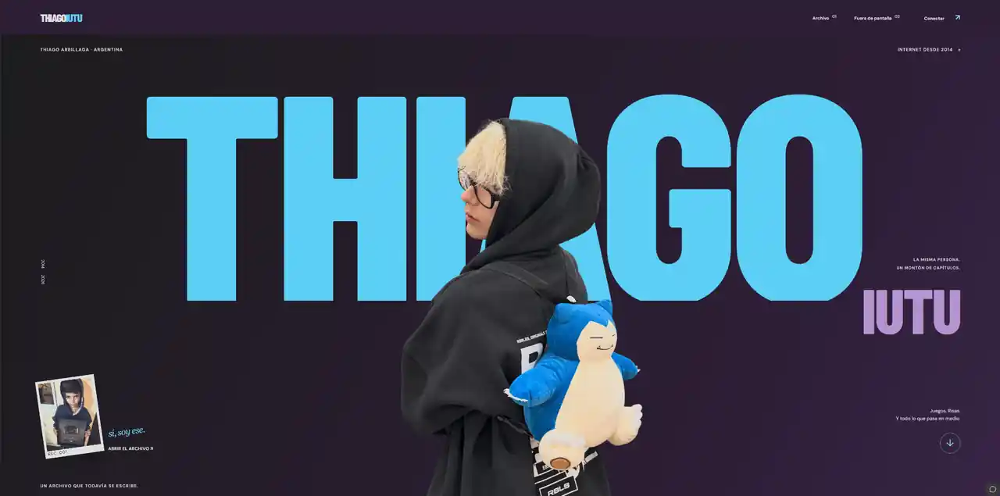

<div align="center">

# ThiagoIUTU — Portfolio

**Portfolio web interactivo dedicado a ThiagoIUTU.**  
Gaming, humor, comunidad, recuerdos y contenido de YouTube dentro de una experiencia visual editorial y cinematográfica.

[](./index.html)
[](./assets)
[](./assets)
[](./vercel.json)
[](./api)

[](https://github.com/PapiGECode/thiagoiutu-portfolio/stargazers)
[](https://github.com/PapiGECode/thiagoiutu-portfolio/commits/main)
[](https://github.com/PapiGECode/thiagoiutu-portfolio)

[Canal de YouTube](https://www.youtube.com/@ThiagoIUTU) · [Repositorio](https://github.com/PapiGECode/thiagoiutu-portfolio)

</div>

<p align="center">
  
</p>

---

## Sobre el proyecto

Este repositorio contiene una web de presentación para **ThiagoIUTU**, creador argentino de contenido centrado en videojuegos, humor, retos, vlogs y comunidad.

La web no está planteada como una landing genérica: utiliza una dirección visual propia, tipografía de gran formato, fotografía protagonista, microinteracciones y narrativa mediante scroll. Además, integra una recreación interactiva del canal de YouTube y una sección independiente dedicada a su familia y recuerdos.

## Características

- **Hero editorial de gran formato** con identidad visual propia y composición centrada en Thiago.
- **Animaciones cinematográficas** con GSAP, ScrollTrigger, SplitText y Lenis.
- **Scroll storytelling** con transiciones, revelados de texto y elementos reactivos.
- **Tema claro y oscuro** con detección de preferencia del sistema y persistencia mediante `localStorage`.
- **Cursor y microinteracciones personalizadas** en escritorio, con adaptación para dispositivos táctiles.
- **Experiencia responsive** para escritorio, tablet y móvil.
- **Soporte para `prefers-reduced-motion`** y navegación por teclado.
- **Página de familia** con álbum visual, hermanos, mascotas y visor de imágenes.
- **Recreación interactiva de YouTube dentro de un teléfono**, con pestañas, vídeos, playlists e información del canal.
- **Datos dinámicos del canal de YouTube** mediante YouTube Data API v3.
- **Fallback local de datos** para mantener contenido disponible cuando la API no responde.
- **Endpoints serverless para Vercel** y servidor local en Python para desarrollo.

---

## Stack

| Área | Tecnología |
| --- | --- |
| Estructura | HTML5 |
| Estilos | CSS3, custom properties, Grid, Flexbox, `clamp()` |
| Interacción | JavaScript vanilla |
| Animación | GSAP, ScrollTrigger, SplitText |
| Smooth scroll | Lenis |
| Tipografía | Bricolage Grotesque, Inter, JetBrains Mono |
| Datos | YouTube Data API v3 |
| Backend ligero | Vercel Serverless Functions / Node.js |
| Desarrollo local | Python `http.server` |
| Despliegue | Vercel |

---

## Estructura del proyecto

```text
.
├── index.html
├── familia.html
├── assets/
│   ├── preview.webp
│   ├── thiago-profile.jpg
│   ├── familia.css
│   ├── familia.js
│   ├── polish.css
│   ├── refinements.js
│   ├── youtube-phone.css
│   ├── youtube-phone.js
│   └── family-*.jpg
├── api/
│   ├── youtube-channel.js
│   ├── youtube-subscribers.js
│   └── fallback-channel.json
├── local_server.py
├── vercel.json
├── CHANGELOG.md
├── LICENSE
└── README.md
```

---

## Ejecutar en local

### 1. Clonar el repositorio

```bash
git clone https://github.com/PapiGECode/thiagoiutu-portfolio.git
cd thiagoiutu-portfolio
```

### 2. Configurar la API de YouTube

Crea un archivo `.env.local` en la raíz:

```env
THIAGO_YOUTUBE_API_KEY=tu_clave_de_youtube_data_api
```

> No subas claves de API al repositorio. Para producción, usa variables de entorno del proveedor de despliegue.

### 3. Iniciar el servidor

```bash
python local_server.py
```

Después abre:

```text
http://127.0.0.1:8000
```

El servidor local también expone:

```text
/api/youtube-channel
/api/youtube-subscribers
```

---

## Despliegue en Vercel

El proyecto ya incluye `vercel.json` y funciones serverless en `/api`.

1. Importa el repositorio en Vercel.
2. Añade `THIAGO_YOUTUBE_API_KEY` como variable de entorno.
3. Despliega sin build command.
4. Vercel servirá la web estática y resolverá las rutas de API automáticamente.

---

## Datos de YouTube

La interfaz del teléfono consulta `/api/youtube-channel` para mostrar información del canal, incluyendo:

- avatar y banner;
- número de suscriptores y vídeos;
- vídeos recientes;
- visualizaciones, duración y estado de directo cuando están disponibles;
- playlists públicas.

El proyecto incluye `api/fallback-channel.json` como respaldo para evitar que la experiencia quede vacía ante fallos temporales de la API.

---

## Personalización

Los puntos principales para editar el proyecto son:

| Elemento | Archivo / ubicación |
| --- | --- |
| Contenido principal y secciones | `index.html` |
| Colores y temas | variables CSS de `:root` y `html.light` |
| Foto principal | `assets/thiago-profile.jpg` |
| Pulido visual | `assets/polish.css` |
| Refinamientos e interacciones | `assets/refinements.js` |
| Interfaz de YouTube | `assets/youtube-phone.css` y `assets/youtube-phone.js` |
| Página de familia | `familia.html`, `assets/familia.css` y `assets/familia.js` |
| Datos de respaldo | `api/fallback-channel.json` |

---

## Accesibilidad y rendimiento

- Respeta `prefers-reduced-motion`.
- Incluye estados de foco y controles accesibles.
- La interfaz de YouTube admite navegación por teclado.
- Se priorizan animaciones basadas en `transform` y `opacity`.
- El diseño se adapta a pantallas pequeñas y dispositivos táctiles.
- Los datos de YouTube utilizan caché en la función serverless para reducir llamadas repetidas.

---

## Licencia

Consulta [`LICENSE`](./LICENSE) para los términos aplicables al código y los recursos de este repositorio.

---

<div align="center">

**ThiagoIUTU Portfolio**  
Una web construida alrededor de su identidad, su contenido y su comunidad.

</div>
